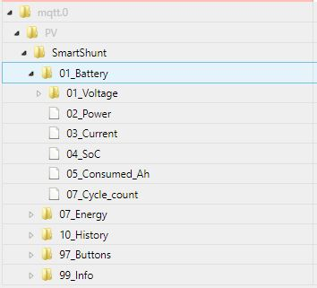

# VictronMPPT-ESPHOME 

ESPHome component to monitor a Victron SmarShunt via ve.direct / UART TTL with an ESP8266 Board

Its made for IoBroker with mqtt connection

Also added:
* Restart Button (topic is publishes to the broker after startup with payload "PRESS " - to restart the ESP, send "PRESS" to this topic)
* some debug sensors
* uptime sensor
* wifi signal sensor
* UART connection indicator as a binary sensor, as well as a number (0 = disconnected / 1 = connected)
* reads UART package every 1s (configurable variable "victron_throttle") - and does not drop packages via fixed throttle
* MQTT publish only on value change or after reaching "sensor_force_update_time" (defaults to 60s)

## MQTT Topic structure made for IOBroker

<a href="images/structure_1.jpg" target="_blank">

</a>

<a href="images/structure_2.jpg" target="_blank">

</a>

<a href="images/structure_3.jpg" target="_blank">

</a>

## Tested devices
  
  * Victron SmartShunt 500A/50mV

## Requirements

* [ESPHome 2021.10 or higher](https://github.com/esphome/esphome/releases).
* Generic ESP8266 board

## Schematics

```
                UART-TTL
┌────────────────┐                ┌──────────────────┐
│           GND o│<-------------->│o GND             │
│ Victron    TX o│--------------->│o D7   ESP32/     │
│ Charger    RX o│                │       ESP8266    │<-- GND
│            5V o│                │                  │<-- 3.3V
└────────────────┘                └──────────────────┘

# UART-TTL jack (JST-PH 2.0mm pinch)
┌─── ─────── ────┐
│                │
│ O   O   O   O  │
│GND  RX  TX VCC │
└────────────────┘
```

If you are unsure about to pin order please measure the voltage between GND and VCC (5V). If you measure a positive voltage you know the position of VCC and GND!

### JST-PH jack

| Pin     | Purpose      | ESP pin        |
| :-----: | :----------- | :------------- |
|  **1**  | **GND**      | GND            |
|    2    | RX           |                |
|  **3**  | **TX**       | D7 (RX)        |
|    4    | 5V           |                |

<a href="images/circuit.jpg" target="_blank">

</a>


### Big thanks to KinDR007 for the origianl repo!
